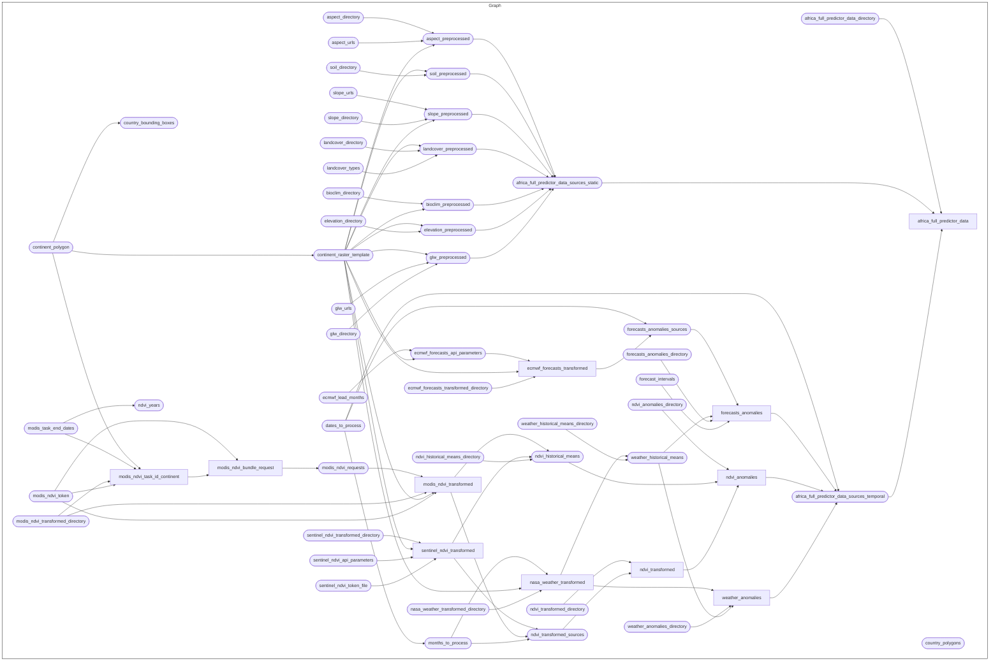

<!-- README.md is generated from README.Rmd. Please edit that file -->

# An open-source framework for Rift Valley Fever forecasting

<!-- badges: start -->

[-MIT-green.svg)](https://opensource.org/licenses/MIT)
[-CC0_1.0-lightgrey.svg)](http://creativecommons.org/publicdomain/zero/1.0/)
[-CC_BY_4.0-blue.svg)](http://creativecommons.org/publicdomain/zero/1.0/)
<!-- badges: end -->

# Overview of OpenRVFcast

The goal of this ongoing `OpenRVFcast` project is the development of a
generalizable, open-source modeling framework for predicting Rift Valley
Fever (RVF) outbreaks in Africa, funded by the Wellcome Trust’s
climate-sensitive infectious disease [modeling
initiative](https://wellcome.org/news/digital-tools-climate-sensitive-infectious-disease).
We aim to integrate open data sets of climatic and vegetation data with
internationally-reported outbreak data to build an modeling pipeline
that can be adapted to varying local conditions in RVF-prone regions
across the continent.

### Pipeline Structure

**Important**: The full modeling pipeline is described in detail in
docs/openRVFcast_Walkthrough.docx.

In brief, the project pipeline is organized into three distinct
“modules” that join together sequentially to form the overall
OpenRVFcast pipeline: 1) the **Data Acquisition Module**, 2) the **Data
Preparation Module**, 3) and the **Modeling Framework Module**. Each
module is orchestrated using the `targets` package in R, a powerful tool
for creating reproducible and efficient data analysis workflows. By
defining a workflow of interdependent tasks, known as ‘targets’, this
package ensures that each step in the workflow is only executed when its
inputs or code change, thereby optimizing computational efficiency. A
modular, scalable, and transparent design makes `targets` an ideal
choice for managing pipelines in reproducible research and production
environments. An introduction to workflow management using `targets` can
be found [here](https://books.ropensci.org/targets/).

This project also uses the [{renv}](https://rstudio.github.io/renv/)
framework to track R package dependencies and versions which are
recorded in the `renv.lock` file. Code used to manage dependencies is in
`renv/` and other files in the root project directory. On starting an R
session in the working directory, run \``renv::hydrate()` and
`renv::restore()` to install required R packags and dependencies.

### Repository Structure

Project code is available on the
[open-rvfcast](https://github.com/One-Health-Research-Consulting/open-rvfcast)
GitHub repository which is organized with the following structure:

- `data/` contains downloaded and transformed data sources. These data
  are .gitignored and are available with access to S3-compatible cloud
  storage or the raw data can be downloaded and processed.
- `R/` contains functions used in this analysis.
- `docs/` contains documentation:
  - `openRVFcast_Walkthrough.docx` - comprehensive details on the full
    modeling pipeline
  - `dynamic_branching_guide.md` - comprehensive guide to the dynamic
    branching implementation
  - `manual.md` - some additional info for running the pipeline
- `outputs/` contains visualization outputs (maps, animations) and
  stores intermediate saved products created in the modeling module

### Data Storage

We utilized parquet files and the `arrow` package in R as our primary
method of storing data. Parquet files are optimized for
high-performance, out-of-memory data processing, making it well-suited
for efficiently handling and processing large, complex datasets.
Additionally, `arrow::open_dataset()` supports seamless integration with
S3-compatible cloud storage (including Cloudflare R2), enabling direct
access to remote datasets, which improves workflow efficiency and
scalability when working with large, distributed data sources.

#### Accessing the Complete Dataset

The first of the modules generates approximately 500 300mb files (meant
to be stored in `data/africa_full_predictor_data`). These data can be
accessed from the cloud (see .env for credentials). The second of the
modules generates a single 800mb file; this file is also accessible from
the cloud (BUT ATM email Noam Ross or Morgan Kain); this file should be
stored in `data/pan_hex_joined_response_data` for the third module
(modeling). **Important**: The `africa_full_predictor_data` dataset only
contains dates for which data was successfully retrieved from **all**
predictor sources. If any predictor is missing for a given date, that
date will not be included in the final dataset. This ensures data
completeness - if a file is present in the `africa_full_predictor_data`
folder, it is guaranteed to contain all predictors for that date.

For more details on how the pipeline handles data dependencies and
incremental updates, see
[`docs/dynamic_branching_guide.md`](docs/dynamic_branching_guide.md).

While the data acquisition module requires the processing of large
datasets, the final cleaned data can be accessed directly from the
cloud:

    dataset <- arrow::open_dataset(arrow::s3_bucket(
      "rvfcast/data/africa_full_predictor_data/",
      endpoint_override = "https://85b2883dde6f6150134acd170f842c81.r2.cloudflarestorage.com",
      anonymous = TRUE
    ))
    dataset$schema

As parquet files are a columnar format with structured metadata
available in each file, some operations, such as filtering, summarizing,
and inspecting the data schema can be applied directly to remote
datasets without having to first download the full data. Calling
collect() on the dataset will initiate the download. For example, the
following will filter the data and then download the model data for a
single day:

    dataset <- arrow::open_dataset(arrow::s3_bucket(
      "rvfcast/data/africa_full_predictor_data/",
      endpoint_override = "https://85b2883dde6f6150134acd170f842c81.r2.cloudflarestorage.com",
      anonymous = TRUE
    )) |>
      dplyr::filter(date == "2005-01-08") |>
      dplyr::collect()

    dataset

However, due to computational demands of such large data, the model
analysis pipeline will download the data in entirety before analysis.
**Important**: The current modeling pipeline uses two randomly chosen
days per month between 2007 and 2024; however, the entire dataset is
available for every day between 2005 and the current year (though none
of the data processing has been run on this “temporally complete”
dataset).

The current full africa predictor dataset is ~1.9 TB. Note that the data
could be stored in a more compact format, but is provided in this
analysis-ready structure to minimize processing time when used in
modeling workflows.

The data targets that are subsetted this way are:

1.  weather_anomalies
2.  weather_anomalies_lagged
3.  forecasts_anomalies
4.  forecast_anomalies_lagged
5.  ndvi_anomalies
6.  ndvi_anomalies_lagged
7.  rvf_response
8.  africa_full_model_data

## 1. Data Acquisition Module

**Important**: The full modeling pipeline is described in detail in
docs/openRVFcast_Walkthrough.docx. However, some important notes, in
brief:

### Cloud Storage

Many of the computational steps in the first module can be time
consuming and either depend on or produce large files. In order to speed
up the pipeline, intermediate files can be stored in S3-compatible cloud
storage for portability. We currently use Cloudflare R2 (S3-compatible
storage). The pipeline will still run without access to cloud storage,
but users can add their own S3-compatible storage credentials to the
`.env` file to enable cloud storage and collaboration with team members.

**S3-compatible cloud storage credentials** to add to the .env file
(already present and set to a bucket owned by Noam Ross):

    AWS_DEFAULT_REGION=auto
    AWS_REGION=auto
    AWS_BUCKET_ID=your-bucket-name
    AWS_ACCESS_KEY_ID=your-access-key
    AWS_SECRET_ACCESS_KEY=your-secret-key
    AWS_S3_ENDPOINT=your-s3-endpoint
    AWS_ENDPOINT_URL=https://${AWS_S3_ENDPOINT}

The pipeline works with any S3-compatible storage including AWS S3,
Cloudflare R2, MinIO, etc. See
[`docs/dynamic_branching_guide.md`](docs/dynamic_branching_guide.md) for
details on how the pipeline uses cloud storage for incremental updates
and team collaboration.

### Data Access

Acquiring the raw source data stores involves first obtaining
authentication credentials, such as API keys, tokens, and certificates.
There are three primary sources of data that require access
credentials 1. [ECMWF](https://www.ecmwf.int/): for accessing monthly
weather forecasts from the European Centre for Medium-Range Weather
Forecasts (ECMWF). 2. [COPERNICUS](https://dataspace.copernicus.eu/):
for accessing Normalized Difference Vegetation Index (NDVI) data derived
from the European Space Agency’s Sentinel-3 satellite. 3.
[APPEEARS](https://appeears.earthdatacloud.nasa.gov/api/): for accessing
historical NDVI data prior to the Sentinel-3 mission from NASA MODIS
satellites.

Before running the data acquisition pipeline, credentials for all three
sources must be added to the .env file.

**Data source API credentials** to add to the .env file:

    ECMWF_USERID=
    ECMWF_TOKEN=
    COPERNICUS_USERNAME=
    COPERNICUS_PASSWORD=
    APPEEARS_USERNAME=
    APPEEARS_PASSWORD=
    APPEEARS_TOKEN=

### Data Sources

All spatial data were interpolated to a resolution of 0.1° across Africa
and standardized to the WGS 84 coordinate reference system. All temporal
data layers were joined by date.

If data files become corrupted they can be re-generated from the raw
sources by setting the `OVERWRITE_X` flags to TRUE in the .env file.
This will prevent the pipeline from first downloading the data from
cloud storage, re-download and process the raw data from the original
sources, and upload the processed files to cloud storage for future use.
Note that, under normal use, these should always be set to FALSE. The
pipeline will automatically download any missing data without having to
change these settings. This is only to replace data that has already
been downloaded and processed mainly for pipeline development purposes.

#### The Response Variable

The goal of this project is to evaluate the potential for an outbreak of
Rift Valley fever (RVF) to occur across Africa. The model was trained
against a binary variable representing whether or not an outbreak
occurred at each spatial location 0-30 days, 30-60 days, 60-90 days,
90-120 days, and 120-150 days after every date. RVF outbreak data was
provided by the [World Animal Health Information System
(WOAH)](https://www.woah.org/en/home/) and accessed via a
[database](https://www.dolthub.com/csv/ecohealthalliance/wahisdb/main/wahis_outbreaks)
of cleaned outbreak data managed by EcoHealth Alliance.

1.  RVF_occurance: A binary factor reflecting RVF occurrence at each
    location across the 5 forecast intervals.

#### Static Data

The following data sources are static, or time-invariant. Raw static
data was downloaded from the linked sources and joined with dynamic
data, such as temperature, which varied by day.

2.  [Soil
    types](https://www.fao.org/soils-portal/data-hub/soil-maps-and-databases/harmonized-world-soil-database-v20/en/):
    Soil types based on the Food and Agriculture Organization of the
    United Nations ([FAO](https://www.fao.org/home/en)) Harmonized World
    Soil Database v2.0 (HWSD) with soil types aggregated into 8
    categories: clay (heavy) + clay loam (1), silt loam + silty clay
    (2), sandy clay + clay (3), loam + silty clay loam (4), sandy clay
    loam (5), sandy loam + silt (6), loamy sand + silt loam (7), and
    sand (8) based on similarity in the USDA sand-silt-clay ternary
    texture class diagram ([Figure
    2](https://www.fao.org/soils-portal/data-hub/soil-maps-and-databases/harmonized-world-soil-database-v20/en/)).
    Data was aggregated by identifying the most common slope or aspect
    within each 0.1 degree grid cell.
3.  [Slope and Aspect](Global%20Terrain%20Slope%20and%20Aspect%20Data):
    Slope and aspect data from the FAO Global Terrain Slope and Aspect
4.  [Gridded Livestock of the World 3
    (GLW3)](https://www.nature.com/articles/sdata2018227): Global
    distribution data included
    [cattle](https://dataverse.harvard.edu/api/access/datafile/6769710),
    [sheep](https://dataverse.harvard.edu/api/access/datafile/6769629),
    and
    [goats](https://dataverse.harvard.edu/api/access/datafile/6769692)
    censused in 2010 and available at a native resolution of 5
    arc-minutes. Data was accessed via the [Harvard
    dataverse](https://dataverse.harvard.edu/).
5.  [Elevation](https://srtm.csi.cgiar.org/): Elevation data accessed
    via the `elevation_global()` function of the
    [geodata](https://rdrr.io/cran/geodata/man/elevation.html) package
    in R, drawn from the Shuttle Radar Topography Mission (SRTM) at
    resolution of 0.5 minutes of a degree.
6.  [Bioclimatic data\*](https://www.worldclim.org/data/bioclim.html):
    Bioclimactic data from the WorldClim version 2.1 accessed via the
    `worldclim_global()` function of the
    [geodata](https://rdrr.io/cran/geodata/man/worldclim.html) package
    in R and represent the global mean values across the period of
    1970-2000 at a 2.5m resolution.
7.  [Landcover
    type](https://search.r-project.org/CRAN/refmans/geodata/html/landcover.html):
    Landcover data was accessed via the `landcover()` function of
    [geodata](https://rdrr.io/cran/geodata/man/elevation.html) package
    in R, drawn from the ESA WorldCover Database with a spatial
    resolution of 30 arc-seconds. Values for each landcover type (trees,
    grassland, shrubs, cropland, built, bare, snow, water, wetland,
    mangroves, and moss), reflect the fraction of each a landcover class
    at each location.

<small>\* Bioclimactic variables included: Annual_Mean_Temperature,
Mean_Diurnal_Range, Isothermality, Temperature_Seasonality,
Max_Temperature_of_Warmest_Month, Min_Temperature_of_Coldest_Month,
Temperature_Annual_Range, Mean_Temperature_of_Wettest_Quarter,
Mean_Temperature_of_Driest_Quarter, Mean_Temperature_of_Warmest_Quarter,
Mean_Temperature_of_Coldest_Quarter, Annual_Precipitation,
Precipitation_of_Wettest_Month, Precipitation_of_Driest_Month,
Precipitation_Seasonality, Precipitation_of_Wettest_Quarter,
Precipitation_of_Driest_Quarter, Precipitation_of_Warmest_Quarter, and
Precipitation_of_Coldest_Quarter</small>

#### Dynamic Data

Dynamic data sources are those that vary with time. Dynamic predictors
can be highly conflated with each other due to a shared dependence on
time, to account for this shared dependence, we used calculated the
anomaly, or difference between current values and historical means,
instead of using the raw values. Anomalies were calculated by first
determining the difference between the current value and its historical
mean for that day-of-year (DOY) and scaled by dividing by the standard
deviation for that DOY. Focusing on anomalous values helped mitigate the
strong correlation with time that naturally exists in environmental
variables like temperature and NDVI. Seasonality was then accounted for
by including year and day-of-year (DOY) as predictors in the model. The
following sources make up the dynamic layers:

8.  [weather_anomalies](): NASA weather data was acquired across Africa
    using the `get_power()` function of the
    [nasapower](https://docs.ropensci.org/nasapower/) package in R which
    provides access to NASA meteorological data from the
    [NASAPOWER](https://power.larc.nasa.gov/) project. The difference,
    or anomaly value, was then found by subtracting each weather value
    from the average value for that day-of-year (DOY).
9.  ndvi_anomalies: NDVI data was sourced from both the NASA’s Moderate
    Resolution Imaging Spectroradiometer
    ([MODIS](https://modis.gsfc.nasa.gov/data/dataprod/mod13)) and the
    European Space Agency’s Copernicus
    [Sentinel-3](https://user.eumetsat.int/catalogue/EO:EUM:DAT:0340)
    missions. MODIS is due to be retired in 2025 while Sentinel-3 NDVI
    data is available from September 2018. MODIS and Sentinel-3 NDVI
    values were interpolated to a daily interval from their native 16
    day (MODIS) and ~10 day (Sentinel-3) intervals using a
    step-function. NDVI values were averaged when data from both sources
    were available. The difference, or anomaly value, was then found by
    subtracting NDVI from the average value for that day-of-year (DOY).

##### Weather Forecasts

10. [ecmwf_forecasts](https://cds.climate.copernicus.eu/datasets/seasonal-monthly-single-levels?tab=overview)
    We also included long-range projections of future weather provided
    by the European Centre for Medium-Range Weather Forecasts (ECMWF)
    and accessed through the [Copernicus Climate Data Store
    (CDS)](https://cds.climate.copernicus.eu/). The projected data
    represent the mean of a 51-member ensemble and include the expected
    average temperature, precipitation, and relative humidity for each
    location across different forecast intervals. Historical forecasts
    were available through hindcasts, which apply the current
    forecasting methods to historical data to simulate what forecasts
    would have been available at those times based on past conditions.

##### Lagged Dynamic Data

Outbreak occurrence is not always directly influenced by the immediately
preceding conditions. Biological systems often involve delayed
responses. For example, heavy precipitation may promote a mosquito
hatch, which can lead to an outbreak only after a delay. To account for
the influence of past environmental conditions, we included lagged
weather and NDVI data, specifically the average values from 0-30, 30-60,
60-90, 90-120, and 120-150 days prior.

11. weather_anomalies: Average weather anomaly values lagged over the
    previous 1-5 months
12. ndvi_anomalies_lagged: Average NDVI anomaly values lagged over the
    previous 1-5 months

##### Historical Outbreak Data

An important factor in evaluating the potential for a future outbreak is
the history of outbreaks in a region. Recent nearby outbreaks can
amplify the likelihood of an outbreak occurring at a given location,
while older outbreaks might reduce the risk by influencing the
resistance landscape, reflecting a history of prior exposure to the
disease.

To account for the influence of outbreak history, we generated outbreak
exposure weights for both recent and historical outbreaks. These weights
were determined using a function that decreases with distance from the
source, modeling exposure as declining exponentially outward to a
maximum distance of 500 km with an exponential rate of decay of
0.01km-1. Similarly, the effects of an outbreak were assumed
to fade over time, with influence declining as time elapsed since the
outbreak increased out to a maximum of 10 years at an exponential rate
of decay of 0.5year-1. Outbreaks that occurred within the
last 3 months were classified as ‘recent’ and included as a separate
predictor in the model allowing them to have a different effect on the
model outcome compared to the older outbreak exposures.

13. outbreak_history: Outbreak history was calculated using the data
    provided from same data described in the response section (item 1)
    above. As outbreak history contains information about the state of
    variable being predicted, special care was taken when splitting the
    data into test and training datasets to prevent data leakage
    described further below.

### Targets Pipeline

#### Error Handling and Pipeline Resilience

The pipeline is designed to be resilient to temporary data source
issues. Many targets include `error = "null"` in their configuration,
which allows the pipeline to continue running even when individual data
sources are temporarily unavailable. This is **expected behavior** and
not a cause for concern.

Common scenarios where errors may occur include:

- **NASA MERRA-2 satellite data delays**: NASA weather data is sometimes
  delayed in posting, causing temporary download failures
- **ECMWF API downtime**: The ECMWF forecast API may be temporarily
  unavailable during maintenance ([check
  status](https://status.ecmwf.int/))
- **Copernicus/Sentinel-3 processing delays**: Satellite imagery
  processing can be delayed
- **MODIS/AppEEARS bundle processing**: Bundle requests may take time to
  process or fail temporarily

When a target fails with `error = "null"`:

1.  The error is logged but the pipeline continues
2.  The failed target will be automatically retried the next time the
    pipeline runs
3.  Downstream targets that depend on the failed data will skip or use
    cached data
4.  The pipeline will eventually succeed once the data source becomes
    available

This design ensures that temporary API issues or data delays don’t block
the entire pipeline. Simply re-run the pipeline periodically to capture
any previously failed targets once their data sources are available.

#### Running the Pipeline

A visualization of the data acquisition module can be found below.
Additional targets not shown are responsible for fetching and storing
intermediate datasets on the cloud. To run the data acquisition module,
download the repository from github and run the following command. Note,
without access to the common S3 bucket store this pipeline will take a
significant amount of time and space to run. In addition, without access
to the remote data store, the data acquisition module must be run before
running the modeling module.

The output of the data acquisition pipeline is an Africa wide dataset
(`africa_full_predictor_data`) produced by joining every source above
together. The following command will start the data acquisition
pipeline, either downloading pre-processed files from cloud storage or
re-generating the data from the raw sources. The expected size of the
full pipeline is ~1.9 TB and so will require significant storage and
time to run. Each day in the africa_full_predictor_data is saved as a
separate parquet file of ~500Mb.

    tar_make(africa_full_predictor_data, script = "predictor_data_processing_targets.R")

For detailed documentation on the pipeline’s dynamic branching
implementation and how incremental updates work, see
docs/openRVFcast_Walkthrough.docx, as well as
[`docs/dynamic_branching_guide.md`](docs/dynamic_branching_guide.md).
For operational usage instructions, see
[`docs/manual.md`](docs/manual.md).

The schematic figure below summarizes the steps of the data acquisition
module. The figure is generated using `mermaid.js` syntax and should
display as a graph on GitHub. It can also be viewed by pasting the code
into <https://mermaid.live>.)

- One or more packages recorded in the lockfile are not installed.
- Use `]8;;x-r-run:renv::status()renv::status()]8;;` for more details.

Attaching package: ‘lubridate’

The following objects are masked from ‘package:base’:

    date, intersect, setdiff, union

retry_tasks was deprecated on 2025-01-24 (version 0.10.2.9005).
Alternative: none.

``` mermaid
graph LR
  style Graph fill:#FFFFFF00,stroke:#000000;
  subgraph Graph
    direction LR
    x308dbc26c1784375(["africa_full_predictor_data_directory"]):::queued --> x29f706fde685a66b["africa_full_predictor_data"]:::queued
    x6b068058ab0e9c52(["africa_full_predictor_data_sources_static"]):::queued --> x29f706fde685a66b["africa_full_predictor_data"]:::queued
    x5cd8db251f348655(["africa_full_predictor_data_sources_temporal"]):::queued --> x29f706fde685a66b["africa_full_predictor_data"]:::queued
    x155e2f0b29a20e05(["aspect_preprocessed"]):::queued --> x6b068058ab0e9c52(["africa_full_predictor_data_sources_static"]):::queued
    xd70b16641fa1b4ef(["soil_preprocessed"]):::queued --> x6b068058ab0e9c52(["africa_full_predictor_data_sources_static"]):::queued
    x680370f9b58b9f6d(["slope_preprocessed"]):::queued --> x6b068058ab0e9c52(["africa_full_predictor_data_sources_static"]):::queued
    xdecc37cc7e708cec(["landcover_preprocessed"]):::queued --> x6b068058ab0e9c52(["africa_full_predictor_data_sources_static"]):::queued
    x1c7b6e6a1c101e59(["bioclim_preprocessed"]):::queued --> x6b068058ab0e9c52(["africa_full_predictor_data_sources_static"]):::queued
    x0dffb1605751d1b1(["elevation_preprocessed"]):::queued --> x6b068058ab0e9c52(["africa_full_predictor_data_sources_static"]):::queued
    x82990a83bfa4db45(["glw_preprocessed"]):::queued --> x6b068058ab0e9c52(["africa_full_predictor_data_sources_static"]):::queued
    x18d8fc5297d7838e(["dates_to_process"]):::queued --> x5cd8db251f348655(["africa_full_predictor_data_sources_temporal"]):::queued
    x680f7450837c9229["forecasts_anomalies"]:::queued --> x5cd8db251f348655(["africa_full_predictor_data_sources_temporal"]):::queued
    xf9b79e824823a870["ndvi_anomalies"]:::queued --> x5cd8db251f348655(["africa_full_predictor_data_sources_temporal"]):::queued
    x01b9e03cb52b7b05["weather_anomalies"]:::queued --> x5cd8db251f348655(["africa_full_predictor_data_sources_temporal"]):::queued
    x42a5375a64b48216(["aspect_directory"]):::queued --> x155e2f0b29a20e05(["aspect_preprocessed"]):::queued
    x213d1d2657d00cd0(["aspect_urls"]):::queued --> x155e2f0b29a20e05(["aspect_preprocessed"]):::queued
    xba6244832b5285ba(["continent_raster_template"]):::queued --> x155e2f0b29a20e05(["aspect_preprocessed"]):::queued
    xe8b8ca5535fe5f2a(["bioclim_directory"]):::queued --> x1c7b6e6a1c101e59(["bioclim_preprocessed"]):::queued
    xba6244832b5285ba(["continent_raster_template"]):::queued --> x1c7b6e6a1c101e59(["bioclim_preprocessed"]):::queued
    xe3c4533ec81ef618(["continent_polygon"]):::queued --> xba6244832b5285ba(["continent_raster_template"]):::queued
    xe3c4533ec81ef618(["continent_polygon"]):::queued --> x53c4b2fb80542353(["country_bounding_boxes"]):::queued
    x8d531cfe4886deda(["ecmwf_lead_months"]):::queued --> x73599238bfebd1c5(["ecmwf_forecasts_api_parameters"]):::queued
    xba6244832b5285ba(["continent_raster_template"]):::queued --> x73599238bfebd1c5(["ecmwf_forecasts_api_parameters"]):::queued
    x73599238bfebd1c5(["ecmwf_forecasts_api_parameters"]):::queued --> x3b5d33025a7856bb["ecmwf_forecasts_transformed"]:::queued
    xba6244832b5285ba(["continent_raster_template"]):::queued --> x3b5d33025a7856bb["ecmwf_forecasts_transformed"]:::queued
    x16ce463b7b647c1e(["ecmwf_forecasts_transformed_directory"]):::queued --> x3b5d33025a7856bb["ecmwf_forecasts_transformed"]:::queued
    xba6244832b5285ba(["continent_raster_template"]):::queued --> x0dffb1605751d1b1(["elevation_preprocessed"]):::queued
    x0381132b9136146c(["elevation_directory"]):::queued --> x0dffb1605751d1b1(["elevation_preprocessed"]):::queued
    x2cc4f7a921353fe4(["forecasts_anomalies_sources"]):::queued --> x680f7450837c9229["forecasts_anomalies"]:::queued
    xbd6b5d8fe3154d5a(["weather_historical_means"]):::queued --> x680f7450837c9229["forecasts_anomalies"]:::queued
    x8ff15aa322c64802(["forecasts_anomalies_directory"]):::queued --> x680f7450837c9229["forecasts_anomalies"]:::queued
    xdac479b8154aa4e0(["forecast_intervals"]):::queued --> x680f7450837c9229["forecasts_anomalies"]:::queued
    x18d8fc5297d7838e(["dates_to_process"]):::queued --> x2cc4f7a921353fe4(["forecasts_anomalies_sources"]):::queued
    x3b5d33025a7856bb["ecmwf_forecasts_transformed"]:::queued --> x2cc4f7a921353fe4(["forecasts_anomalies_sources"]):::queued
    xba6244832b5285ba(["continent_raster_template"]):::queued --> x82990a83bfa4db45(["glw_preprocessed"]):::queued
    x4d4a15b2f0f1851f(["glw_urls"]):::queued --> x82990a83bfa4db45(["glw_preprocessed"]):::queued
    x5448b80c3909d641(["glw_directory"]):::queued --> x82990a83bfa4db45(["glw_preprocessed"]):::queued
    xba6244832b5285ba(["continent_raster_template"]):::queued --> xdecc37cc7e708cec(["landcover_preprocessed"]):::queued
    x8894af119fe2eaa1(["landcover_directory"]):::queued --> xdecc37cc7e708cec(["landcover_preprocessed"]):::queued
    x684d7fe78b0e841d(["landcover_types"]):::queued --> xdecc37cc7e708cec(["landcover_preprocessed"]):::queued
    x3f3ba2f9e89a9591(["modis_ndvi_token"]):::queued --> xcfc776190ac6b73c["modis_ndvi_bundle_request"]:::queued
    xa5bc51cd67d5e6c0["modis_ndvi_task_id_continent"]:::queued --> xcfc776190ac6b73c["modis_ndvi_bundle_request"]:::queued
    xcfc776190ac6b73c["modis_ndvi_bundle_request"]:::queued --> xb64343d9bc0ef12e(["modis_ndvi_requests"]):::queued
    xe3c4533ec81ef618(["continent_polygon"]):::queued --> xa5bc51cd67d5e6c0["modis_ndvi_task_id_continent"]:::queued
    xb406dc4c2762194f(["modis_task_end_dates"]):::queued --> xa5bc51cd67d5e6c0["modis_ndvi_task_id_continent"]:::queued
    xdc843e2504e22144(["modis_ndvi_transformed_directory"]):::queued --> xa5bc51cd67d5e6c0["modis_ndvi_task_id_continent"]:::queued
    x3f3ba2f9e89a9591(["modis_ndvi_token"]):::queued --> xa5bc51cd67d5e6c0["modis_ndvi_task_id_continent"]:::queued
    xb64343d9bc0ef12e(["modis_ndvi_requests"]):::queued --> x5130788afbe32544["modis_ndvi_transformed"]:::queued
    xdc843e2504e22144(["modis_ndvi_transformed_directory"]):::queued --> x5130788afbe32544["modis_ndvi_transformed"]:::queued
    xba6244832b5285ba(["continent_raster_template"]):::queued --> x5130788afbe32544["modis_ndvi_transformed"]:::queued
    x3f3ba2f9e89a9591(["modis_ndvi_token"]):::queued --> x5130788afbe32544["modis_ndvi_transformed"]:::queued
    x18d8fc5297d7838e(["dates_to_process"]):::queued --> x63a0e22e7393f7fe(["months_to_process"]):::queued
    x63a0e22e7393f7fe(["months_to_process"]):::queued --> x0548e231345702f7["nasa_weather_transformed"]:::queued
    xba6244832b5285ba(["continent_raster_template"]):::queued --> x0548e231345702f7["nasa_weather_transformed"]:::queued
    x711dc87df29f0a9c(["nasa_weather_transformed_directory"]):::queued --> x0548e231345702f7["nasa_weather_transformed"]:::queued
    xe2329877730e44b5(["ndvi_anomalies_directory"]):::queued --> xf9b79e824823a870["ndvi_anomalies"]:::queued
    x44345ceb9b3d4a81(["ndvi_historical_means"]):::queued --> xf9b79e824823a870["ndvi_anomalies"]:::queued
    xb8d88361e3190fbf["ndvi_transformed"]:::queued --> xf9b79e824823a870["ndvi_anomalies"]:::queued
    x5130788afbe32544["modis_ndvi_transformed"]:::queued --> x44345ceb9b3d4a81(["ndvi_historical_means"]):::queued
    xa4eb23442420052a["sentinel_ndvi_transformed"]:::queued --> x44345ceb9b3d4a81(["ndvi_historical_means"]):::queued
    x7fef416d6ce259f3(["ndvi_historical_means_directory"]):::queued --> x44345ceb9b3d4a81(["ndvi_historical_means"]):::queued
    x704a24502f5bfcb5(["ndvi_transformed_directory"]):::queued --> xb8d88361e3190fbf["ndvi_transformed"]:::queued
    x40d4d27d6a4a2824(["ndvi_transformed_sources"]):::queued --> xb8d88361e3190fbf["ndvi_transformed"]:::queued
    xa4eb23442420052a["sentinel_ndvi_transformed"]:::queued --> x40d4d27d6a4a2824(["ndvi_transformed_sources"]):::queued
    x5130788afbe32544["modis_ndvi_transformed"]:::queued --> x40d4d27d6a4a2824(["ndvi_transformed_sources"]):::queued
    x63a0e22e7393f7fe(["months_to_process"]):::queued --> x40d4d27d6a4a2824(["ndvi_transformed_sources"]):::queued
    xb406dc4c2762194f(["modis_task_end_dates"]):::queued --> x5173ee721c44ebc0(["ndvi_years"]):::queued
    x3ea733d22e9c32e7(["sentinel_ndvi_transformed_directory"]):::queued --> xa4eb23442420052a["sentinel_ndvi_transformed"]:::queued
    xba6244832b5285ba(["continent_raster_template"]):::queued --> xa4eb23442420052a["sentinel_ndvi_transformed"]:::queued
    x6e1924e349d8e6e8(["sentinel_ndvi_api_parameters"]):::queued --> xa4eb23442420052a["sentinel_ndvi_transformed"]:::queued
    x45b75d590706329f(["sentinel_ndvi_token_file"]):::queued --> xa4eb23442420052a["sentinel_ndvi_transformed"]:::queued
    x1ef0d1881ff89dbd(["slope_urls"]):::queued --> x680370f9b58b9f6d(["slope_preprocessed"]):::queued
    x165085d61327782d(["slope_directory"]):::queued --> x680370f9b58b9f6d(["slope_preprocessed"]):::queued
    xba6244832b5285ba(["continent_raster_template"]):::queued --> x680370f9b58b9f6d(["slope_preprocessed"]):::queued
    xba6244832b5285ba(["continent_raster_template"]):::queued --> xd70b16641fa1b4ef(["soil_preprocessed"]):::queued
    x9c14f0532ee1f83c(["soil_directory"]):::queued --> xd70b16641fa1b4ef(["soil_preprocessed"]):::queued
    x0548e231345702f7["nasa_weather_transformed"]:::queued --> x01b9e03cb52b7b05["weather_anomalies"]:::queued
    xf94f7486eed9869c(["weather_anomalies_directory"]):::queued --> x01b9e03cb52b7b05["weather_anomalies"]:::queued
    xbd6b5d8fe3154d5a(["weather_historical_means"]):::queued --> x01b9e03cb52b7b05["weather_anomalies"]:::queued
    x0548e231345702f7["nasa_weather_transformed"]:::queued --> xbd6b5d8fe3154d5a(["weather_historical_means"]):::queued
    x4407a62768444c3e(["weather_historical_means_directory"]):::queued --> xbd6b5d8fe3154d5a(["weather_historical_means"]):::queued
    x4847fdb918188b25(["country_polygons"]):::queued
  end
```

## 2. Data Preparation

In this module the raw (minorly cleaned) data saved to disk in Module 1
is further cleaned and combined into the single master tibble covariate
stack that is used in model fitting in Module 3. The key steps in this
module are combining covariates with cases, building lagged variables,
and collapsing data into w/e spatial aggregation is chosen (currently H3
hex or ADM2).

For complete details see docs/openRVFcast_Walkthrough.docx

## 3. Data Preparation

This module contains all of the modeling steps from hyperparameter
tuning through to final model fitting, prediction visualization, and
automated report generation.

For complete details see docs/openRVFcast_Walkthrough.docx

A key aspect of the modeling pipeline is our spatial and temporal
splitting strategy for cross validation (starting on page 8 of
docs/openRVFcast_Walkthrough.docx). Splitting data into training,
validation, and test sets is an important step for building robust and
reliable models. The training set is used to learn model parameters, the
validation set helps fine-tune hyperparameters and prevent overfitting,
and the test set provides an unbiased evaluation of the model’s
performance on unseen data. Proper splitting ensures the model
generalizes well to new data, avoiding issues like data leakage or
over-optimistic performance estimates.

### More resources

Follow the links for more information about:

- [`targets`](https://ecohealthalliance.github.io/eha-ma-handbook/3-projects.html#targets)
- [`renv`](https://ecohealthalliance.github.io/eha-ma-handbook/3-projects.html#package-management-with-renv)  
- [`git-crypt`](https://ecohealthalliance.github.io/eha-ma-handbook/16-encryption.html)
- [`Reproducible workflows`](https://github.com/ecohealthalliance/building-blocks-of-reproducibility)
