<!-- README.md is generated from README.Rmd. Please edit that file -->

# An open-source framework for Rift Valley Fever forecasting

<!-- badges: start -->

[-MIT-green.svg)](https://opensource.org/licenses/MIT)
[-CC0_1.0-lightgrey.svg)](http://creativecommons.org/publicdomain/zero/1.0/)
[-CC_BY_4.0-blue.svg)](http://creativecommons.org/publicdomain/zero/1.0/)
<!-- badges: end -->

### OpenRVFcast

EcoHealth Alliance’s ongoing OpenRVFcast project is developing a
generalizable, open-source modeling framework for predicting Rift Valley
Fever (RVF) outbreaks in Africa. The project is funded by the Wellcome
Trust’s climate-sensitive infectious disease modeling
[initiative](https://wellcome.org/news/digital-tools-climate-sensitive-infectious-disease)
and aims to integrate open data sets of climatic and vegetation data
with internationally-reported outbreak data to build an adaptable
modeling pipeline that can be applied to varying local local conditions
in RVF-prone regions across the continent.

### Repository Structure and Reproducibility

- `data/` contains downloaded and transformed data sources. These data
  are .gitignored and non-EHA users will need to download the data.
- `R/` contains functions used in this analysis.
- `reports/` contains literate code for R Markdown reports generated in
  the analysis
- `outputs/` contains compiled reports and figures.
- This project uses the [{renv}](https://rstudio.github.io/renv/)
  framework to record R package dependencies and versions. Packages and
  versions used are recorded in `renv.lock` and code used to manage
  dependencies is in `renv/` and other files in the root project
  directory. On starting an R session in the working directory, run
  `renv::restore()` to install R package dependencies.
- This project uses the
  [{targets}](https://wlandau.github.io/targets-manual/) framework to
  organize build steps for analysis pipeline. The schematic figure below
  summarizes the steps. (The figure is generated using `mermaid.js`
  syntax and should display as a graph on GitHub. It can also be viewed

``` mermaid
graph LR
subgraph Project Workflow
    direction LR
    xcec9a7631fb026ee(["ecmwf_forecasts_directory"]):::skipped --> xa5738a057262b61d(["ecmwf_forecasts_upload_aws_s3"]):::skipped
    x9c76f3c92ea2d49d["ecmwf_forecasts_downloaded"]:::skipped --> xa5738a057262b61d(["ecmwf_forecasts_upload_aws_s3"]):::skipped
    xa1d97300a3b205ca(["continent_bounding_box"]):::skipped --> xbb3aa5bc7b1658be(["ecmwf_api_parameters"]):::skipped
    x0ba8074843dd369a(["continent_polygon"]):::skipped --> x012d23f29668478a(["continent_raster_template_plot"]):::built
    x2afa632571070318(["continent_raster_template"]):::built --> x012d23f29668478a(["continent_raster_template_plot"]):::built
    x2afa632571070318(["continent_raster_template"]):::built --> x01658e026e0a29fd["sentinel_ndvi_transformed_rasters"]:::built
    xfd232772a977e694(["sentinel_ndvi_directory"]):::skipped --> x01658e026e0a29fd["sentinel_ndvi_transformed_rasters"]:::built
    x26dfd01796db7ec2["sentinel_ndvi_downloaded"]:::skipped --> x01658e026e0a29fd["sentinel_ndvi_transformed_rasters"]:::built
    x0ba8074843dd369a(["continent_polygon"]):::skipped --> xa1d97300a3b205ca(["continent_bounding_box"]):::skipped
    xfd232772a977e694(["sentinel_ndvi_directory"]):::skipped --> xe97089048cc40c8d(["sentinel_ndvi_upload_aws_s3"]):::built
    x26dfd01796db7ec2["sentinel_ndvi_downloaded"]:::skipped --> xe97089048cc40c8d(["sentinel_ndvi_upload_aws_s3"]):::built
    xcec9a7631fb026ee(["ecmwf_forecasts_directory"]):::skipped --> xff73ba0124e5a017["ecmwf_forecasts_flat_transformed"]:::built
    x9c76f3c92ea2d49d["ecmwf_forecasts_downloaded"]:::skipped --> xff73ba0124e5a017["ecmwf_forecasts_flat_transformed"]:::built
    xb038a30f0a35723c(["modis_ndvi_directory"]):::built --> x44ef5d48bcfaea21(["modis_ndvi_upload_aws_s3"]):::queued
    x77ec1b9f60190564["modis_ndvi_downloaded"]:::queued --> x44ef5d48bcfaea21(["modis_ndvi_upload_aws_s3"]):::queued
    xd854377155612be3(["wahis_rvf_outbreaks_raw"]):::built --> xeadd38ebf89ffb3e(["wahis_rvf_outbreaks_preprocessed"]):::built
    x479365af91c7e266(["sentinel_ndvi_api_parameters"]):::skipped --> x26dfd01796db7ec2["sentinel_ndvi_downloaded"]:::skipped
    xfd232772a977e694(["sentinel_ndvi_directory"]):::skipped --> x26dfd01796db7ec2["sentinel_ndvi_downloaded"]:::skipped
    xbb3aa5bc7b1658be(["ecmwf_api_parameters"]):::skipped --> x9c76f3c92ea2d49d["ecmwf_forecasts_downloaded"]:::skipped
    xcec9a7631fb026ee(["ecmwf_forecasts_directory"]):::skipped --> x9c76f3c92ea2d49d["ecmwf_forecasts_downloaded"]:::skipped
    x0ba8074843dd369a(["continent_polygon"]):::skipped --> x2afa632571070318(["continent_raster_template"]):::built
    xa1d97300a3b205ca(["continent_bounding_box"]):::skipped --> x77ec1b9f60190564["modis_ndvi_downloaded"]:::queued
    xb038a30f0a35723c(["modis_ndvi_directory"]):::built --> x77ec1b9f60190564["modis_ndvi_downloaded"]:::queued
    xa3da9b3925f9741f(["modis_ndvi_years"]):::built --> x77ec1b9f60190564["modis_ndvi_downloaded"]:::queued
    xd52ee303d6021275(["country_polygons"]):::skipped --> x39dbcca303e23588(["country_bounding_boxes"]):::built
    xf72c4ee15d2a0400(["nasa_weather_directory"]):::built --> xbfbce2d14bfd3f89(["nasa_weather_upload_aws_s3"]):::built
    x43cae5645a1256a7["nasa_weather_downloaded"]:::skipped --> xbfbce2d14bfd3f89(["nasa_weather_upload_aws_s3"]):::built
    x39dbcca303e23588(["country_bounding_boxes"]):::built --> xbe17c5133608677e(["nasa_weather_coordinates"]):::built
    xbe17c5133608677e(["nasa_weather_coordinates"]):::built --> x43cae5645a1256a7["nasa_weather_downloaded"]:::skipped
    xf72c4ee15d2a0400(["nasa_weather_directory"]):::built --> x43cae5645a1256a7["nasa_weather_downloaded"]:::skipped
    x5f34aae31382da1e(["nasa_weather_variables"]):::built --> x43cae5645a1256a7["nasa_weather_downloaded"]:::skipped
    x910c507cd106a733(["nasa_weather_years"]):::built --> x43cae5645a1256a7["nasa_weather_downloaded"]:::skipped
  end
linkStyle 0 stroke-width:0px;
```

  by pasting the code into <https://mermaid.live>.)

To run the pipeline, the user will need to adapt the `_targets.R` file
to use their own object storage repository (we use AWS) and will need to
supply keys in an `.env` file.

Follow the links for more information about:

- [`targets`](https://ecohealthalliance.github.io/eha-ma-handbook/3-projects.html#targets)
- [`renv`](https://ecohealthalliance.github.io/eha-ma-handbook/3-projects.html#package-management-with-renv)  
- [git-crypt](https://ecohealthalliance.github.io/eha-ma-handbook/16-encryption.html)
- [Reproducible
  workflows](https://github.com/ecohealthalliance/building-blocks-of-reproducibility)
